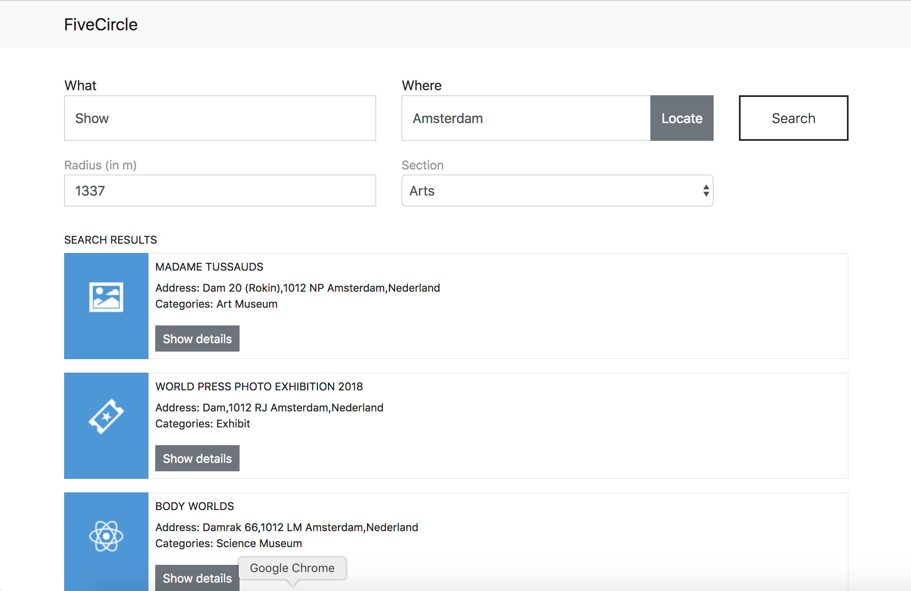
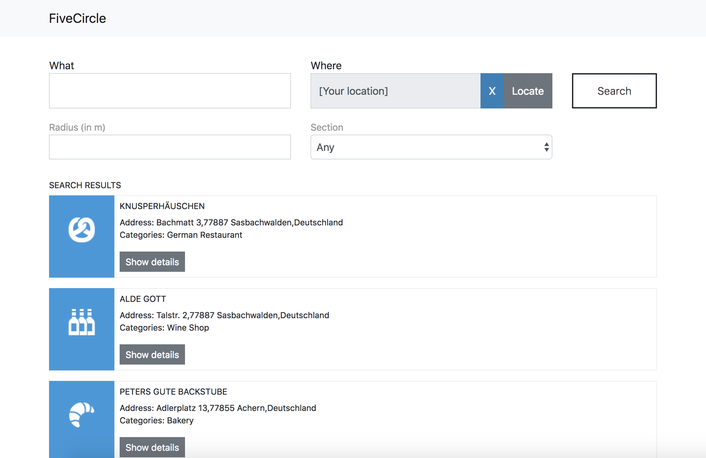

# FiveCircle venue search

Web app to search for venues via the FourSquare API created for Adyen coding challenge.
Implemented using React, Bootstrap 4, NodeJs and ExpressJs (for application server that does not 
reveal API secrets).

## Own Requirements

* Search query for venues based on names
* Free text location filter to get results near a certain location
* Secondary inputs to limit radius of results and section of venues 
* Show venues in list view


### Open requirements
* Use better error handling than simple alerts.
* Pagination for venues list.
* Proper validation for parameters.
* Autocomplete location using Google geocoding.
* Give user possibility to show results in Google maps.
* Allow user to login to FourSquare account using oAuth.
* Use slider for range and Select2 for sections with auto complete.

## Request handling

1. Browser client sends request to application server (express.js).
2. Application server performs rudimentary validation and forwards request after adding API secrets.
3. FourSquare server responds with data or error.
4. Application server forwards data or error to client.

## Develop 

```bash
    # Install all requirements:
    yarn
    
    # Set private FourSquare API auth parameters
    export FOURSQUARE_CLIENT_ID="YOUR_CLIENT_ID"
    export FOURSQUARE_CLIENT_SECRET="YOUR_CLIENT_SECRET"
    
    # Start API:
    node src/server/server.js
    
    # Watch changes and start development server with hot reload:
    yarn start
``` 

## Live demo

[https://warm-reef-22976.herokuapp.com/](https://warm-reef-22976.herokuapp.com/)

## Screens




